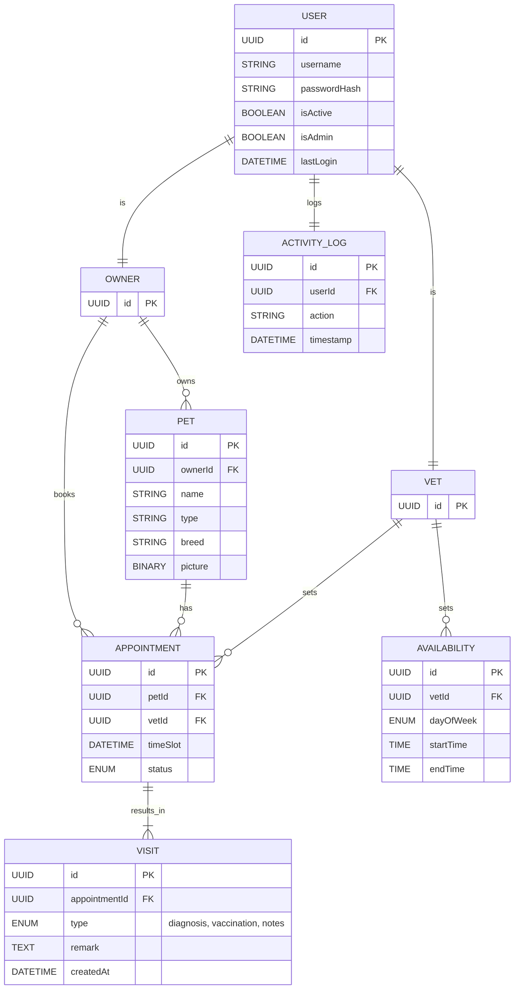

# 🧩 Domain Model - Recommendation

## Main Entities
| Entity       | Description |
|--------------|-------------|
| `User`       | User with name, role and credentials |
| `Owner`      | User with a pet |
| `Pet`        | Pet with name, birth date, type and picutre |
| `Vet`        | Veterinarian with name |
| `Availability`| Opening hours or available slots of a vet |
| `Appointment`| Scheduled visit between an owner and a vet for a pet |
| `Visit`      | A entry created by vet with notes and diagnosis |
| `ActivityLog`| Simple Audit |

## Relationships

- A `Owner` can own multiple `Pets` (1:N)
- A `Pet` can have multiple `Appointments` (1:N)
- A `Vet` (User) can have multiple `Appointments` (1:N)
- A `Vet` (User) can define multiple `Availability` slots (1:N)
- Each `Appointment` can result in one Visit (1:1)
- A `User` can have multiple `ActivityLogs` (1:N)

---
