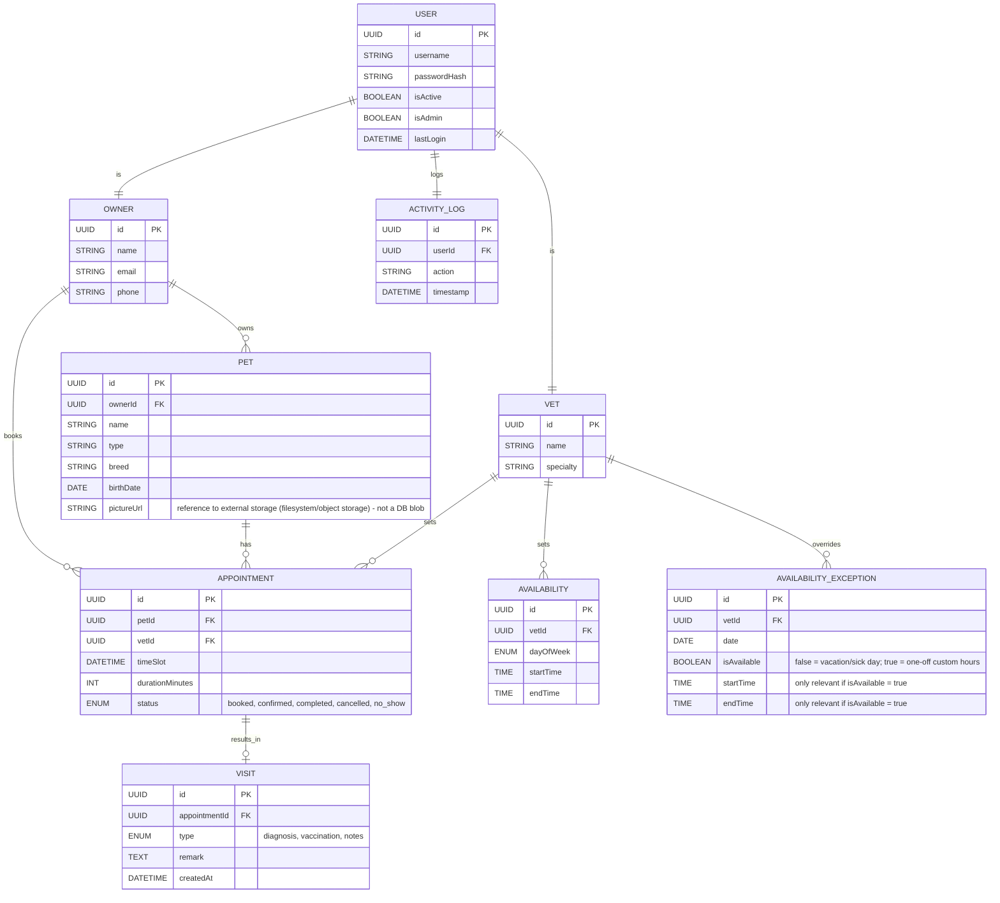
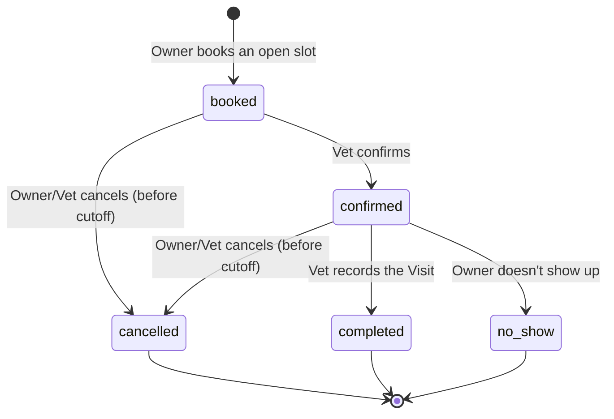

# 🧩 Domain Model - Recommendation

```mermaid
erDiagram
    USER {
        UUID id PK
        STRING username
        STRING passwordHash
        BOOLEAN isActive
        BOOLEAN isAdmin
        DATETIME lastLogin
    }
    USER ||--|| OWNER : is
    USER ||--|| VET : is
    USER ||--|| ACTIVITY_LOG : logs

    OWNER {
        UUID id PK
        STRING name
        STRING email
        STRING phone
    }
    OWNER ||--o{ PET : owns
    OWNER ||--o{ APPOINTMENT : books
    
    PET {
        UUID id PK
        UUID ownerId FK
        STRING name
        STRING type
        STRING breed
        DATE birthDate
        STRING pictureUrl "reference to external storage (filesystem/object storage) - not a DB blob"
    }
    PET ||--o{ APPOINTMENT : has
   
    VET {
        UUID id PK
        STRING name
        STRING specialty
    }
    VET ||--o{ AVAILABILITY : sets
    VET ||--o{ AVAILABILITY_EXCEPTION : overrides
    VET ||--o{ APPOINTMENT : sets
    
    AVAILABILITY {
        UUID id PK
        UUID vetId FK
        ENUM dayOfWeek
        TIME startTime
        TIME endTime
    }

    AVAILABILITY_EXCEPTION {
        UUID id PK
        UUID vetId FK
        DATE date
        BOOLEAN isAvailable "false = vacation/sick day; true = one-off custom hours"
        TIME startTime "only relevant if isAvailable = true"
        TIME endTime "only relevant if isAvailable = true"
    }
    
    APPOINTMENT {
        UUID id PK
        UUID petId FK
        UUID vetId FK
        DATETIME timeSlot
        INT durationMinutes
        ENUM status "booked, confirmed, completed, cancelled, no_show"
    }
    APPOINTMENT ||--o| VISIT : results_in

    VISIT {
        UUID id PK
        UUID appointmentId FK
        ENUM type "diagnosis, vaccination, notes"
        TEXT remark
        DATETIME createdAt
    }

    ACTIVITY_LOG {
        UUID id PK
        UUID userId FK
        STRING action
        DATETIME timestamp
    }


    
```

## Main Entities

| Entity       | Description |
|--------------|-------------|
| `User`       | User with name, role and credentials |
| `Owner`      | User with a pet |
| `Pet`        | Pet with name, birth date, type and picture |
| `Vet`        | Veterinarian with name and specialty |
| `Availability`| Recurring weekly opening hours / bookable slots of a vet |
| `AvailabilityException`| One-off override of a vet's recurring availability (vacation, sick day, custom hours) |
| `Appointment`| Scheduled visit between an owner and a vet for a pet, with a duration and lifecycle status |
| `Visit`      | An entry created by vet with notes and diagnosis, once an appointment is completed |
| `ActivityLog`| Simple Audit |

## Relationships

- A `Owner` can own multiple `Pets` (1:N)
- A `Pet` can have multiple `Appointments` (1:N)
- A `Vet` (User) can have multiple `Appointments` (1:N)
- A `Vet` (User) can define multiple `Availability` slots (1:N)
- A `Vet` (User) can define multiple `AvailabilityException` overrides (1:N)
- An `Appointment` results in at most one `Visit` (1:0..1) — only `completed` appointments have one
- A `User` can have multiple `ActivityLogs` (1:N)

---

## 📅 Appointment Lifecycle & Business Rules

The `Appointment` entity is the deliberate complexity anchor of PetcliniX — see
[Functionality Requirements](index.md#appointment-business-rules) for the rationale. Every
implementation is expected to enforce the following, regardless of paradigm:

```mermaid
stateDiagram-v2
    [*] --> booked: Owner books an open slot
    booked --> confirmed: Vet confirms
    booked --> cancelled: Owner/Vet cancels (before cutoff)
    confirmed --> cancelled: Owner/Vet cancels (before cutoff)
    confirmed --> completed: Vet records the Visit
    confirmed --> no_show: Owner doesn't show up
    cancelled --> [*]
    completed --> [*]
    no_show --> [*]
```

- **Availability is derived**: bookable slots = `Availability` (recurring weekly) − existing
  `Appointment`s − `AvailabilityException`s. It is computed on read, not persisted as its own table.
- **Overlap, not equality**: because `Appointment.durationMinutes` varies, a new booking must be
  checked against existing appointments as a time-range overlap for that `vetId`.
- **Concurrency-safe booking**: a slot must not be bookable twice under concurrent requests — this
  is the one rule implementations should not solve with "check then insert" alone.
- **Cutoff-gated cancellation**: `cancelled` is only reachable from `booked`/`confirmed` before a
  configurable cutoff (e.g. 2h before `timeSlot`); a reschedule is a cancel+rebook, still subject to
  the overlap and concurrency rules above.
- **Invalid transitions are rejected**: e.g. `completed` is only reachable from `confirmed`.

---
