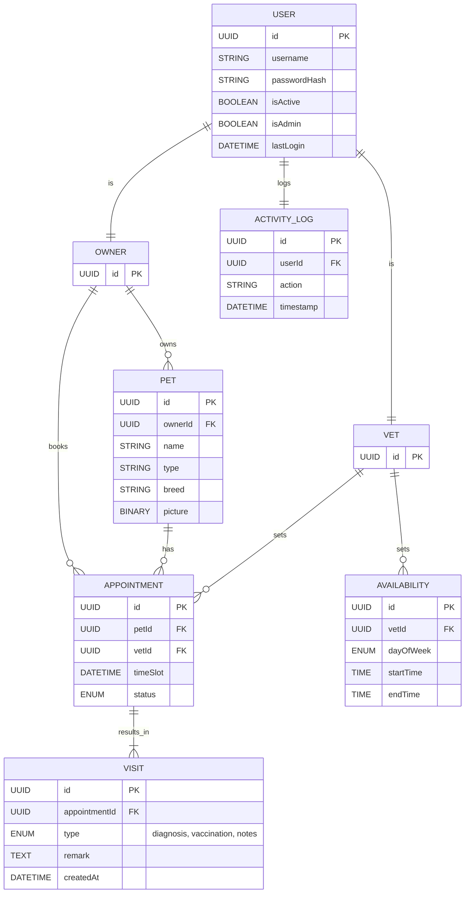

# Petclinix - Domain and Features

## 🖥️ Functionality from End-User Perspective

### 🧍‍♂️ Pet Owner Features

- Register/Login (simple, no mail challenges or OAuth needed)
- Add Pet (name, type, breed, picture upload)
- View Pet Profile (with diagnosis & vaccination history)
- Book Appointment (select vet, time slot)

### 🩺 Vet Features

- Register/Login (simple, no mail challenges or OAuth needed)
- Set Availability (weekly schedule, bookable slots)
- View Appointments
- Record Visit (diagnosis, vaccination, notes), Pet Owner can view the visits

### 🛠️ Admin Features

- User Management (list, deactivate users)
- Basic Activity Logs (last login, actions)
- Simple Stats Dashboard (e.g., # of pets, appointments per vet)

---

## 👥 Roles

### Pet Owner
- View and manage pets
- Book appointments
- View visit history

### Veterinarian
- Define availability and time slots
- View and manage appointments
- Document visits

### Admin / Clinic Staff
- Manage owners, pets, vets, and appointments
- Monitor booking activity

---

## 🧩 Domain Model

### Main Entities
| Entity       | Description |
|--------------|-------------|
| `User`       | User with name, role and credentials |
| `Owner`      | User with a pet |
| `Pet`        | Pet with name, birth date, type and picutre |
| `Vet`        | Veterinarian with name |
| `Availability`| Opening hours or available slots of a vet |
| `Appointment`| Scheduled visit between an owner and a vet for a pet |
| `Visit`      | A entry created by vet with notes and diagnosis |
| `ActivityLog`| Simple Audit |

### Relationships

- A `Owner` can own multiple `Pets` (1:N)
- A `Pet` can have multiple `Appointments` (1:N)
- A `Vet` (User) can have multiple `Appointments` (1:N)
- A `Vet` (User) can define multiple `Availability` slots (1:N)
- Each `Appointment` can result in one Visit (1:1)
- A `User` can have multiple `ActivityLogs` (1:N)

---

